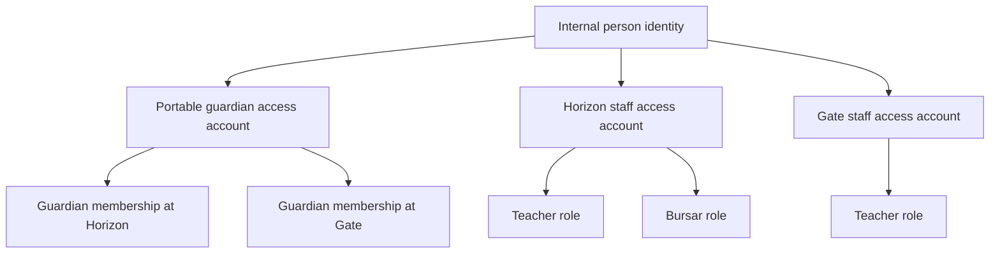
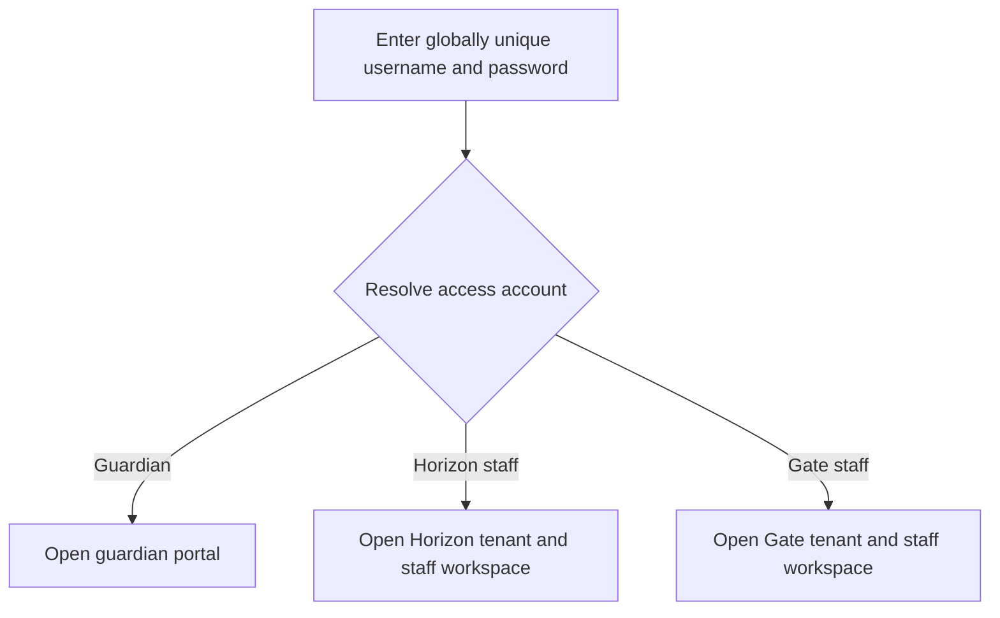
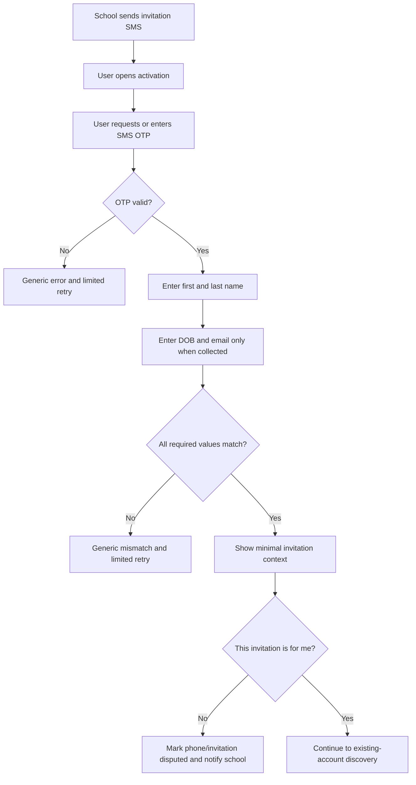
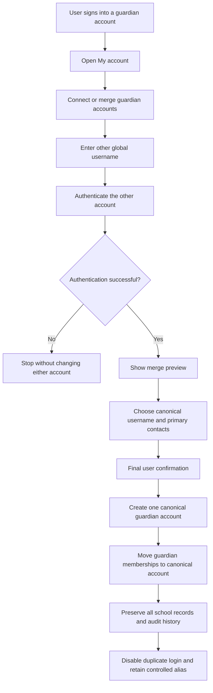
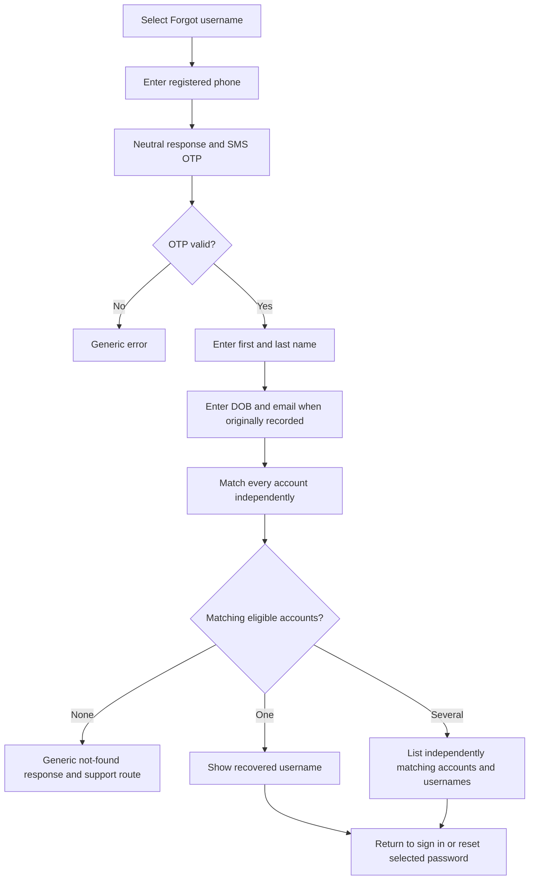

# SMA Identity, Invitation, Account Access, and Recovery Specification

**Status:** Product and implementation source of truth  
**Audience:** Product owners, designers, backend engineers, frontend engineers, QA engineers, school administrators, and support staff  
**Last updated:** 21 August 2026  
**Scope:** Staff and guardian account creation, invitation verification, existing-account discovery, usernames, passwords, account separation, guardian-account merging, and account recovery

---

## 1. Purpose

SMA is a multi-school SaaS application. One real person may be:

- a guardian at one or more schools;
- a staff member with several roles at one school;
- a staff member at more than one school; and
- both a guardian and a staff member, including at the same school.

These situations make account creation more complicated than simply declaring an email address or phone number unique. Phone numbers can be mistyped, shared, changed, or reassigned by a network. Names may differ between schools. Email and date of birth may not always be collected. Schools must not be permitted to join accounts belonging to a person without that person's authorization.

This document defines the business logic and the technical boundaries needed to:

1. create accounts virtually and safely;
2. avoid unintended account duplication;
3. keep staff employment access isolated by school;
4. give guardians convenient access across schools;
5. allow users to merge duplicate guardian accounts;
6. recover forgotten usernames without exposing private information; and
7. preserve all school-specific records when identities or accounts are connected.

This is a specification. An item appearing in this document must not be assumed to exist in the application until its implementation and tests are complete.

---

## 2. Final account model

### 2.1 Three separate concepts

SMA must distinguish these concepts:

1. **Person identity** — an internal indication that multiple access accounts have been proven to be controlled by the same real person.
2. **Access account** — a username, password, status, recovery contacts, and login boundary.
3. **School record** — staff, guardian, household, child, finance, attendance, assessment, medical, or other operational data belonging to a particular school.

They must not be represented as one undifferentiated user record.



An internal person association does not cause the related access accounts to share passwords, sessions, permissions, or school data.

### 2.2 Guardian account

A guardian access account is portable across schools.

```text
Guardian account: ama.mensah
├── Horizon Academy guardian membership
│   ├── Child: Kofi
│   └── Child: Abena
└── Gate Academy guardian membership
    └── Child: Kojo
```

Business rules:

- A guardian normally has one guardian username and password.
- The same guardian account may contain guardian memberships at several schools.
- The guardian sees only children and data that each school has explicitly related to that guardian.
- Duplicate guardian access accounts may be merged by the user after ownership of every account is proven.
- Merging access accounts does not merge school ledgers, households, admissions, medical records, or other school-specific records.

### 2.3 Staff account

A staff access account belongs to exactly one school.

```text
Horizon staff account: ama.mensah27
├── Teacher role
├── Bursar role
└── Administrator role
```

Business rules:

- A person has a maximum of one staff access account at a particular school.
- All staff roles at that school belong to the same staff access account.
- Adding a role does not create another account.
- A returning employee reuses and, where authorized, reactivates the existing staff account.
- Employment periods, contracts, positions, salaries, and documents may have separate history records underneath the same staff account.
- A staff member employed by two schools has two isolated staff access accounts.
- Staff accounts belonging to different schools are not merged.
- Suspension or termination by one school must not affect another school's staff account.

### 2.4 A staff member who is also a guardian

Staff and guardian access remain separate even when they belong to the same person and the same school.

```text
Ama Mensah
├── Guardian account
│   └── Horizon guardian membership
└── Horizon staff account
    ├── Teacher role
    └── Bursar role
```

Consequences:

- There are separate usernames and password hashes.
- Staff suspension does not suspend guardian access.
- Parent data is never opened merely because a staff session exists.
- Staff permissions are never inherited by the guardian session.
- Guardian and staff accounts are not candidates for account merging.
- SMA may associate them with the same internal person identity only after the user proves control of both accounts.

### 2.5 Account decision matrix

| Situation | Required outcome |
|---|---|
| Teacher becomes Bursar at the same school | Add the Bursar role to the existing staff account |
| Former employee returns to the same school | Reactivate the staff account and create a new employment period |
| Staff member joins another school | Create a separate staff account for the new school |
| Staff member is also a guardian | Keep the staff and guardian accounts separate |
| Guardian has children at multiple schools | Add school memberships to the portable guardian account |
| Two guardian accounts are proven to belong to the same user | Allow a user-controlled guardian-account merge |
| Guardian account and staff account appear to match | They may be associated to a person after proof, but never merged |
| Staff accounts from different schools appear to match | They may be associated to a person after proof, but never merged |
| Two staff accounts at the same school | Invalid state; prevent it in application logic and the database |

---

## 3. Usernames and passwords

### 3.1 Username rule

Every access account has a globally unique username. A username alone must identify:

- the exact access account;
- whether it is a staff or guardian account;
- the school for a staff account; and
- the correct tenant and role context.

The login form must not require the user to select a school.

Example:

```text
ama.mensah    -> portable guardian account
ama.mensah27  -> Horizon staff account
ama.mensah42  -> Gate staff account
```

Usernames should not have to contain a school name. The system should suggest globally available usernames after invitation verification, and the user may accept or edit a suggestion.

### 3.2 Password rule

Every access account has its own password hash.

- Multiple staff roles at one school share the same staff-account password.
- Staff accounts at different schools have separate password hashes.
- Staff and guardian accounts have separate password hashes.
- Resetting one account's password never changes another account.
- A school must never choose or retain the user's permanent password.
- A school may issue a temporary invitation, but the user creates the permanent password during activation.

### 3.3 Login routing



If a staff username is entered on the custom domain of a different school, SMA must not load the account's actual school data inside the wrong branded application. It should reject the tenant mismatch and direct the user to the correct portal or general SMA login.

### 3.4 Phone and email are not permanent identities

Phone and email remain useful for:

- invitation delivery;
- verification;
- notifications;
- possible-account detection;
- username recovery; and
- password recovery.

They are not the permanent database identity and may be attached to several intentionally separate access accounts. The authoritative identifiers are immutable internal IDs.

---

## 4. School-created invitation

### 4.1 Information collected by the school

Before sending an invitation, the school records:

- first name — required;
- last name — required;
- phone number — required for the agreed launch flow;
- email address — optional; and
- date of birth — optional.

The school also provides the invitation context:

- account type: `STAFF` or `GUARDIAN`;
- school;
- intended role or relationship;
- staff position/department when applicable; and
- a reference to the school record being created.

### 4.2 Provisional invitation, not a permanent account

Creating an invitation must not immediately create a fully active access account. It creates a restricted provisional invitation.

Before activation, it must not expose:

- children;
- medical information;
- fees or payments;
- reports;
- staff information;
- school records; or
- possible accounts or schools belonging to the invited person.

The provisional session may only:

- verify the invitation;
- report an incorrect phone or identity;
- make the account decision;
- create credentials when required; and
- contact the school through a controlled support route.

### 4.3 Invitation and OTP lifetimes

Recommended defaults:

- SMS OTP lifetime: 10 minutes;
- OTP attempts: maximum 5;
- personal-information match attempts: maximum 3;
- invitation lifetime: 72 hours;
- resend operations: rate-limited;
- OTP: single-use; and
- verified activation session: short-lived and bound to the invitation.

These values should be configurable, but weakening them requires a documented security decision.

---

## 5. Virtual invitation verification

### 5.1 Required verification data

Always require:

- SMS verification code;
- first name; and
- last name.

Require only when the school supplied the information:

- date of birth; and
- email address.

The email does not have to be verified for this comparison. It is a knowledge-matching value, not evidence that the user controls the email address.

### 5.2 Verification flow



### 5.3 Normalization and matching

Name comparison should:

- ignore capitalization;
- trim leading and trailing spaces;
- collapse repeated spaces;
- use a documented, consistent policy for apostrophes and hyphens; and
- preserve the original spelling for display and audit.

Date of birth, when supplied, must match the full date exactly.

Email comparison should trim spaces and ignore domain/local-part capitalization according to the application's normalized-email policy.

The verification response must never identify which field was incorrect.

### 5.4 Incorrect phone number

An OTP proves only that the recipient currently controls the phone. First name, last name, and any optional recorded information reduce the chance that a mistyped or recycled number can be used to activate the invitation.

The SMS and activation page must provide `This is not me`.

Selecting it must:

1. stop activation;
2. mark the invitation and phone as disputed;
3. notify the school without exposing the recipient's information;
4. prevent repeated automated messages until reviewed; and
5. require the school to correct the contact and issue a new invitation.

No method based only on a phone and biographical information provides absolute identity proof. For that reason, linking or merging an existing access account always requires authentication of the existing account.

---

## 6. Existing-account discovery

### 6.1 Discovery occurs after invitation verification

The system must not expose candidate accounts before the invitation phone and required personal information have been verified.

Possible matching signals include:

- exact current phone match;
- exact email match;
- normalized first and last name;
- exact DOB when available;
- legacy username aliases; and
- an already confirmed internal person association.

Matching creates a candidate only. It never authorizes a connection, association, or merge.

### 6.2 Privacy-preserving message

Before the user authenticates the candidate account, show only:

```text
You may already have an SMA account.

[Use an existing account]
[This is not my account]
[Decide later]
```

Do not reveal the candidate account's:

- school;
- children;
- staff role;
- full email;
- full phone;
- complete username; or
- records.

### 6.3 Proof of account control

To prove control of a candidate account, require either:

- its globally unique username and password through central SMA authentication;
- a valid already-authenticated session for that exact account; or
- the full account-recovery process for that exact account.

Typing the same phone, name, DOB, or email again is not sufficient.

### 6.4 Authentication must remain central

Existing-account credentials must be entered into SMA's central authentication surface. A school-specific form must not collect the password of an account associated with another school.

---

## 7. What happens after an account is discovered

The outcome depends on the invitation type and candidate account type.

### 7.1 Guardian invitation finds an existing guardian account

After successful authentication:

- add the new school's guardian membership to the existing guardian account;
- do not create a new username;
- retain the existing guardian password;
- preserve the school's guardian and household records separately; and
- audit acceptance of the membership.

The invitation is being connected to an existing account; this is not necessarily a full historical account merge.

### 7.2 Guardian invitation finds another guardian account with history

If both guardian accounts already contain records, use the user-driven guardian merge defined in section 9.

### 7.3 Staff invitation finds the same school's staff account

Do not create another account.

- Add the new role to the existing staff account, or create a new employment period.
- Preserve inactive, suspended, revoked, and historical statuses.
- Do not silently reactivate a suspended or revoked role.
- Require the user to accept the new role/employment invitation.

### 7.4 Staff invitation finds another school's staff account

Create a new school-specific staff account with a new globally unique username and password.

After the user authenticates the existing staff account, SMA may associate both staff accounts with the same internal person identity. They remain separate security principals.

### 7.5 Staff invitation finds a guardian account

Create a separate school-specific staff account. The guardian and staff accounts do not merge.

After the user authenticates the guardian account, SMA may record a confirmed person association. This must not share sessions, credentials, or permissions.

### 7.6 User says “This is not my account”

- Do not connect or associate the candidate.
- Continue creating the intended account when the invitation is otherwise valid.
- Require a new globally unique username and password.
- Preserve a privacy-safe possible-match audit entry.
- Do not show the rejected candidate during ordinary account recovery unless it independently satisfies that account's recovery rules.

### 7.7 User says “Decide later”

If the user needs immediate application access:

- create a separate access account with its own globally unique username and password;
- leave the candidate unconnected;
- provide `Connect accounts` under `My account`; and
- do not share records or permissions before later proof and confirmation.

---

## 8. Confirmed person association versus account merging

These operations are different.

### 8.1 Person association

A person association says:

> The user proved control of these access accounts, so SMA has evidence that the same person controls them.

It does not combine:

- usernames;
- passwords;
- sessions;
- roles;
- permissions; or
- school records.

This is appropriate for staff accounts from different schools and for staff-plus-guardian accounts.

### 8.2 Account merge

An account merge says:

> These are duplicate access accounts of a type that should be portable, and the user wants one canonical account.

Under the agreed model, ordinary self-service merging applies to guardian accounts. Staff accounts from different schools and staff-plus-guardian accounts do not merge.

### 8.3 Confidence levels

| Evidence | Meaning |
|---|---|
| Same phone | Possible match |
| Same phone and name | Stronger possible match |
| Same phone, name, and DOB | High-confidence possible match |
| Authentication of both accounts | Confirmed control of both accounts |

Only confirmed control permits association or merging.

---

## 9. User-driven guardian-account merge

### 9.1 Authority

- A school may suggest that an existing account was found.
- A school cannot merge accounts.
- The user initiates or confirms the merge.
- Central SMA support may assist only through an audited recovery/review process.

### 9.2 Merge flow



### 9.3 Three or more guardian accounts

The user may verify and merge all accounts in one reviewed operation or add them one at a time.

All later merges must point directly to the canonical guardian account. Do not create alias chains such as `C -> B -> A`.

### 9.4 Merge preview

After ownership is proven, the preview should show:

- guardian memberships by school;
- children and households by school;
- primary and alternative verified contacts;
- username options;
- conflicting user-controlled profile fields; and
- records that will remain school-specific.

No irreversible operation occurs before explicit final confirmation.

### 9.5 Username after merge

The user chooses one canonical globally unique guardian username. Other guardian usernames may remain controlled aliases for a configurable transition period, recommended at 90 days.

Aliases must resolve directly to the canonical account and must never retain independent credentials.

---

## 10. Data preservation and conflict resolution

### 10.1 Governing rule

**Merge the guardian access identity, not the school records.**

### 10.2 Unified information

The canonical guardian account contains user-controlled authentication information:

- canonical guardian username;
- password hash;
- preferred display name;
- primary verified phone;
- primary verified email; and
- alternative recovery contacts.

### 10.3 Information that remains school-specific

- Guardian records
- Household relationships
- Children
- Staff profiles
- Employment records
- Addresses supplied to each school
- Admissions
- Fees, payments, receipts, and balances
- Attendance
- Assessments and reports
- Medical information
- Documents
- Incidents
- Audit history

Updating a global contact must not silently overwrite every school's official record. The application may allow the user to send an update request to selected schools.

### 10.4 Conflicting information

The user selects primary global values. Original school values remain attached to their source.

Example:

```text
Canonical guardian account
Preferred name: Ama Owusu-Mensah
Primary phone: +233242222222
Recovery phone: +233241111111

Horizon guardian record
Name recorded: Ama Owusu
Address: Madina

Gate guardian record
Name recorded: Ama Owusu-Mensah
Address: East Legon
```

### 10.5 Same-school guardian records

A guardian may legitimately relate to multiple households or children at the same school. Merging access accounts must preserve all relationships.

If two records appear to duplicate the same household relationship, create a school review task. Do not delete or combine the school records silently.

### 10.6 Financial integrity

Receipts, allocations, student ledgers, household ledgers, waivers, balances, and payment histories retain their original school, student, household, transaction ID, and dates. Identity merging must never rewrite financial meaning.

---

## 11. Forgot username

### 11.1 Objective

Recover globally unique usernames without requiring a school selection and without exposing accounts to an unverified person.

### 11.2 Flow



### 11.3 Account matching rule

For each account independently, require:

```text
current eligible phone matches
AND first name matches
AND last name matches
AND DOB matches when recorded for recovery
AND email matches when recorded for recovery
```

An account with conflicting information is excluded. Do not reveal that an excluded account exists.

### 11.4 Results

After successful verification, results may show:

```text
Guardian account
Username: ama.mensah

Horizon Academy staff
Username: ama.mensah27

Gate Academy staff
Username: ama.mensah42
```

Displaying the school at this verified stage helps the user distinguish intentionally separate staff accounts. It does not require school selection during ordinary login.

### 11.5 Recovery does not merge accounts

Listing several usernames means only that each account independently matched the recovery evidence. It does not merge them, associate them automatically, or share passwords.

---

## 12. Forgot password

Password recovery must target one exact account.

```text
Enter globally unique username
        ↓
Resolve exact account
        ↓
Verify OTP using an eligible recovery contact
        ↓
Match first and last name
        ↓
Match DOB/email when recorded
        ↓
Set a new password for this account only
```

Rules:

- Never reset every account using the same phone.
- A staff password reset does not reset guardian access.
- A reset at one school does not affect another school's staff account.
- Recovery attempts and completed resets must be audited.
- High-privilege staff accounts may require an additional school or central-support recovery control.

---

## 13. Account and invitation states

### 13.1 Invitation states

| State | Meaning |
|---|---|
| `DRAFT` | School has not sent the invitation |
| `SENT` | Invitation sent; verification incomplete |
| `PHONE_VERIFIED` | OTP passed |
| `IDENTITY_INFORMATION_VERIFIED` | Required name and optional data matched |
| `ACCOUNT_DECISION_PENDING` | Possible account found; user decision pending |
| `ACTIVATED` | Membership/account activation completed |
| `DISPUTED` | Recipient selected “This is not me” |
| `LOCKED` | Attempt limit exceeded |
| `EXPIRED` | Invitation expired |
| `CANCELLED` | School cancelled the invitation |

State transitions must be validated server-side. A client cannot skip directly to `ACTIVATED`.

### 13.2 Access-account states

| State | Meaning |
|---|---|
| `INVITED` | Credentials not finalized |
| `ACTIVE` | Login permitted |
| `SUSPENDED` | Temporarily blocked |
| `DEACTIVATED` | Access ended |
| `LOCKED` | Security lock |
| `MERGED` | Duplicate guardian login disabled and redirected to canonical account |

Staff role and employment status must remain separate from the access-account status. A revoked Bursar role must not be restored merely because the staff account remains active as Teacher.

---

## 14. Permissions and visibility

### 14.1 School capabilities

A school may:

- create and cancel its invitations;
- correct invitation data before activation;
- assign staff roles within its school;
- activate, suspend, or revoke its staff access according to policy;
- create and maintain its guardian/household relationships; and
- review possible duplicate school records after a user-controlled guardian merge.

A school may not:

- merge global guardian accounts;
- see candidate accounts at other schools before user authentication;
- collect another account's password;
- reactivate another school's staff account;
- modify another school's data; or
- infer unrelated schools or children from a matching phone.

### 14.2 User capabilities

A user may:

- accept or reject an invitation;
- report an incorrect phone/invitation;
- choose globally unique credentials;
- authenticate an existing account;
- decide whether to merge eligible guardian accounts;
- postpone eligible guardian-account connection;
- choose canonical guardian username and contacts;
- recover usernames; and
- reset one selected account password.

### 14.3 Central support capabilities

Central SMA support may assist inaccessible accounts only through a separately authorized, fully audited recovery process. Support must not bypass proof merely because profile data looks similar.

---

## 15. Suggested backend domain model

Names may be adapted to project conventions, but the concepts must remain distinct.

### 15.1 Core entities

#### `PersonIdentity`

- immutable ID;
- confidence/verification status;
- created and updated timestamps; and
- no school operational data.

#### `AccessAccount`

- immutable account ID;
- optional confirmed person identity ID;
- account type: `GUARDIAN` or `STAFF`;
- staff school ID when account type is `STAFF`;
- globally unique username;
- password hash;
- account status;
- canonical account ID for merged aliases; and
- security timestamps.

#### `AccountContact`

- account ID;
- type: phone or email;
- raw and normalized value;
- verified status;
- verification source and time;
- login/recovery eligibility;
- primary/alternative status; and
- active/revoked status.

Communication contacts and login/recovery identifiers should be distinguishable. A shared phone may be a communication contact without being sufficient to select one access account globally.

#### `SchoolMembership`

- account ID;
- school ID;
- membership type;
- state; and
- accepted/revoked timestamps.

For a staff account, exactly one school membership is allowed. A guardian account may have several.

#### `MembershipRole`

- membership ID;
- role;
- role status;
- effective dates; and
- audit data.

#### `AccountInvitation`

- invitation ID;
- school ID;
- account type;
- normalized invitation data;
- intended roles/relationship;
- state;
- attempt counters;
- expiry; and
- audit timestamps.

#### `VerificationChallenge`

- challenge ID;
- invitation or account ID;
- purpose;
- hashed OTP;
- expiry;
- attempt count;
- verified time; and
- consumed time.

Never store an OTP in plaintext.

#### `AccountAssociation`

- person identity ID;
- access account IDs;
- proof method;
- confirmation time; and
- audit actor.

#### `AccountMerge`

- canonical guardian account ID;
- merged guardian account IDs;
- preview snapshot;
- user confirmation;
- status;
- completed time; and
- audit details.

#### `UsernameAlias`

- alias;
- canonical account ID;
- expiry/revocation; and
- reason.

### 15.2 Critical database constraints

- Globally unique active username.
- One active staff account per confirmed person identity and school.
- One membership per account and school.
- One role record per membership and role/effective period as defined by role history.
- A staff access account may have only one school membership.
- A merged alias resolves to exactly one canonical guardian account.
- A challenge can be consumed only once.
- Financial and school records retain their original tenant keys.

Constraints apply once accounts are confirmed to represent the same person. Unconfirmed candidate matches must not be forcibly assigned to a person identity.

---

## 16. Suggested API responsibilities

Exact paths may follow existing SMA conventions.

### Invitation

- Create invitation
- Send/resend invitation
- Verify SMS OTP
- Verify recorded information
- Mark invitation as not intended for recipient
- Retrieve minimal verified invitation context
- Accept or reject invitation

### Candidate discovery and proof

- Discover privacy-safe candidate existence
- Begin central authentication for a candidate
- Confirm proof of candidate control
- Associate accounts to a person without merging

### Account activation

- Check global username availability
- Generate username suggestions
- Set initial password
- Activate separate account
- Connect guardian membership to existing guardian account
- Add role/reactivate same-school staff account

### Guardian merge

- Start merge
- Add and authenticate guardian account
- Generate merge preview
- Resolve global conflicts
- Confirm merge
- Read merge status/audit

### Recovery

- Begin forgot-username recovery
- Verify recovery OTP
- Match recovery information
- List independently eligible usernames
- Begin password reset for exact username
- Complete password reset

Every state-changing endpoint must be idempotent where retries are reasonably expected.

---

## 17. Security and privacy requirements

1. Never merge or associate accounts automatically from personal-data similarity.
2. Never treat phone control as proof of historical account ownership.
3. Never reveal schools, roles, or children before appropriate verification.
4. Use neutral responses before phone verification to prevent account enumeration.
5. Store OTP hashes, not OTP plaintext.
6. Enforce expiry, attempt limits, resend limits, and replay prevention server-side.
7. Authenticate candidate accounts through central SMA authentication.
8. Keep staff sessions tenant-scoped to the staff account's school.
9. Keep guardian authorization scoped to explicitly linked children and schools.
10. Never union revoked or suspended roles during association or guardian merging.
11. Preserve original tenant and transaction ownership on every historical record.
12. Audit invitation creation, verification, rejection, activation, association, merge, alias use, recovery, and password reset.
13. Protect logs from containing passwords, OTP values, or unnecessary personal data.
14. Provide support processes for recycled phone numbers and inaccessible recovery contacts.

---

## 18. Audit requirements

Audit events should include:

- event type;
- account/invitation/person IDs;
- school ID where relevant;
- actor type and actor ID;
- timestamp;
- source IP/device metadata according to privacy policy;
- previous and new state;
- reason; and
- correlation ID.

Required events include:

- invitation created/sent/resent/cancelled/expired;
- OTP requested/passed/failed/locked;
- personal-information verification passed/failed/locked;
- recipient reported `not me`;
- candidate found without recording excessive candidate details;
- candidate authentication passed/failed;
- staff role added or reactivated;
- person association created/revoked;
- guardian merge started/confirmed/completed/failed;
- username alias created/used/revoked;
- username recovered; and
- password reset requested/completed.

---

## 19. Error and support behavior

User-facing errors should be specific enough to guide action but must not leak private data.

Examples:

```text
The verification code is incorrect or expired.

The information does not match the school invitation. Check the spelling or ask the school to correct it.

We could not find an eligible account using the information provided.

This username is unavailable. Choose another suggestion.

This staff account does not belong to this school's portal.
```

Do not say:

```text
The phone was correct but the date of birth was wrong.

This number belongs to a teacher at Gate Academy.

We found a guardian with two children at Horizon Academy.
```

---

## 20. Minimum launch implementation

Before production launch, implement:

1. globally unique usernames;
2. separate guardian and school-scoped staff access accounts;
3. one staff account per confirmed person and school;
4. multiple staff roles inside one staff account;
5. provisional invitations;
6. SMS OTP plus required name and optional recorded-data matching;
7. `This is not me` and disputed-invitation handling;
8. privacy-safe existing-account discovery;
9. central authentication before using an existing account;
10. existing guardian membership connection;
11. same-school staff role addition/reactivation;
12. separate staff-account creation for another school;
13. account-specific password reset;
14. forgot-username recovery;
15. tenant-scoped authorization; and
16. complete audit events and automated tests.

Later phases may add:

- full multi-account guardian merge center;
- username transition aliases;
- advanced conflict-resolution UI;
- assisted central-support recovery;
- passkeys or stronger MFA;
- risk scoring; and
- user-visible account association management.

The data model used at launch must still support these later capabilities without destructive migration.

---

## 21. Acceptance criteria

### Invitation and activation

- A school can create a staff or guardian invitation with required first name, last name, and phone.
- DOB and email are optional and are requested from the recipient only when supplied.
- An invitation cannot activate without valid OTP and required information matching.
- Incorrect recipients can report `This is not me` without gaining access.
- Locked, expired, cancelled, or disputed invitations cannot be replayed.

### Account boundaries

- A guardian and staff account remain separate even for the same person and school.
- A person cannot have two staff accounts at the same school once identity is confirmed.
- Additional staff roles use the existing staff account.
- Staff accounts at different schools have separate credentials and sessions.
- A guardian account can contain memberships at multiple schools.

### Usernames and login

- Every active access-account username is globally unique.
- Username and password are sufficient for ordinary login; no school selection is required.
- The username resolves the correct account type and tenant.
- A custom-domain tenant mismatch cannot expose another school's application data.

### Discovery, association, and merge

- A personal-data match never automatically connects accounts.
- Candidate details remain hidden until candidate-account authentication succeeds.
- Staff accounts from different schools can be confirmed as belonging to one person without merging.
- Guardian accounts can be merged only after every account is authenticated and the user confirms the preview.
- No school can merge global accounts.

### Recovery

- Forgot username requires phone OTP, first name, last name, and optional recorded DOB/email.
- Every account is matched independently.
- An account with conflicting data is not exposed.
- Password reset affects only the exact selected username.

### Data integrity

- School records remain tenant-scoped after association or guardian merge.
- Financial records retain original transaction, student, household, school, and date meaning.
- Conflicting school profile values are not silently overwritten.
- All security-sensitive actions are audited.

---

## 22. Required test catalogue

### Invitation tests

1. Correct phone, names, DOB, and email.
2. Correct phone and names when DOB/email were not collected.
3. Incorrect OTP.
4. Expired OTP.
5. OTP replay.
6. Incorrect first name.
7. Incorrect last name.
8. Incorrect optional DOB.
9. Incorrect optional email.
10. Attempt-limit lock.
11. Expired invitation.
12. Cancelled invitation.
13. Recipient selects `This is not me`.
14. School corrects phone and reissues invitation.

### Existing-account tests

15. No candidate account.
16. Candidate based only on phone.
17. Candidate with matching phone/name/DOB.
18. Candidate password incorrect.
19. Candidate authentication succeeds.
20. User selects `This is not my account`.
21. User selects `Decide later`.
22. Candidate details remain private before authentication.

### Guardian tests

23. New guardian account with one school.
24. Existing guardian account accepts another school membership.
25. Guardian rejects another school's invitation.
26. Two historical guardian accounts merge.
27. Three guardian accounts merge into one canonical account.
28. Conflicting guardian contacts require user selection.
29. Same-school multiple household relationships remain intact.
30. Guardian merge does not alter receipts or balances.

### Staff tests

31. New staff account at first school.
32. Existing same-school staff account receives another role.
33. Returning employee receives a new employment period.
34. Suspended role is not silently reactivated.
35. Staff member joins another school and receives a separate account.
36. Staff account at School A cannot access School B.
37. Database rejects a second confirmed staff account for the same person/school.
38. Staff-plus-guardian accounts remain separate.
39. Suspending staff access does not suspend guardian access.

### Username and recovery tests

40. Username uniqueness under concurrent creation.
41. Username routes to correct tenant without school selection.
42. Custom-domain mismatch is rejected safely.
43. Forgot username with one matching account.
44. Forgot username with several independently matching accounts.
45. Conflicting account is excluded without being disclosed.
46. Recycled-phone scenario with different name/DOB.
47. Password reset changes only the selected account.
48. Rate limiting prevents enumeration and brute force.

### Audit and failure tests

49. Every state transition emits the required audit event.
50. Notification-provider retry does not duplicate activation.
51. Concurrent merge requests remain idempotent.
52. Failure during guardian merge leaves a recoverable consistent state.
53. Merged username alias cannot authenticate independently.
54. Logs do not contain passwords or OTP plaintext.

---

## 23. Reference end-to-end examples

### 23.1 New guardian with no existing account

```text
Horizon records Ama's name and phone
→ invitation sent
→ Ama verifies OTP and name
→ no guardian candidate found
→ Ama chooses global username and password
→ Horizon guardian membership activates
```

### 23.2 Existing guardian joins another school

```text
Gate records Ama's name and phone
→ invitation verified
→ possible guardian account found
→ Ama signs into ama.mensah
→ Ama accepts Gate membership
→ no new username is created
→ ama.mensah now contains Horizon and Gate guardian access
```

### 23.3 Horizon guardian becomes Horizon teacher

```text
Horizon creates staff invitation
→ Ama verifies it
→ guardian account may be recognized
→ Ama authenticates it only to confirm person association
→ new Horizon staff account is created
→ guardian and staff credentials remain separate
```

### 23.4 Horizon teacher joins Gate

```text
Gate creates staff invitation
→ Ama verifies it
→ Horizon staff candidate may be detected
→ Ama authenticates Horizon account
→ SMA records confirmed same-person association
→ separate Gate staff username/password are created
→ Horizon and Gate access remain isolated
```

### 23.5 Existing Horizon teacher becomes Bursar

```text
Horizon initiates Bursar role invitation
→ system resolves existing Horizon staff account
→ Ama accepts
→ Bursar role added to the same account
→ no new username or password
```

### 23.6 Forgotten username with several accounts

```text
Ama verifies her phone
→ enters name and any recorded DOB/email
→ SMA matches each account independently
→ shows ama.mensah, ama.mensah27, and ama.mensah42
→ Ama selects one for sign-in or password reset
→ no accounts are merged
```

---

## 24. Summary of non-negotiable rules

1. Username alone identifies the access account; no school selector is required at login.
2. Every username is globally unique.
3. Guardian accounts are portable across schools.
4. Staff accounts are isolated per school.
5. Multiple staff roles at one school share one staff account.
6. Staff and guardian accounts remain separate, even at the same school.
7. Phone matching detects candidates but never authorizes connection or merging.
8. Invitation verification always requires OTP, first name, and last name.
9. DOB and email are required only when previously collected.
10. Existing-account control must be proven through actual authentication or recovery.
11. Staff accounts from different schools do not merge.
12. Guardian accounts may be merged only by the user.
13. Merging access identities never overwrites school-specific records.
14. Forgot-username matching evaluates every account independently.
15. Password reset affects one exact username only.
16. Every security-sensitive action is tenant-safe and audited.

